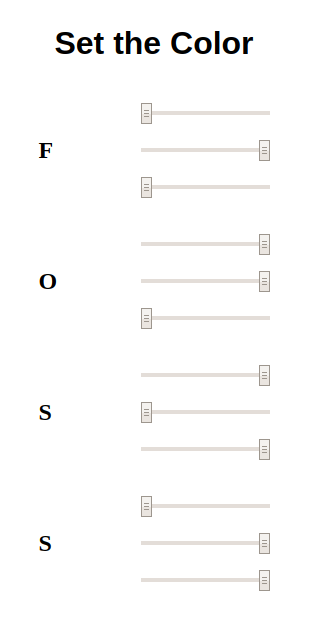

# Minimal Front-End

A component for the **FOSS-LETTERS** project.

This is the absolute bare-bones the UI for this could get. No color feedback, just blasting the server with whatever the sliders are at. Sliders are R,G,B from top down, one set for each letter.



## Installation

You've cloned this repo? Good job, that's it.

## Configuration

Our interface will send color change requests at a server - we need to know where that server is.

At the very top of index.js, there should be something that looks like this:

```html
<script type="text/javascript">
	const COLOR_CHANGE_SERVER = "http://laptop.ewitherington.me:8000";
</script>
```

Set that variable to whatever works for you.

## Running

My favorite method:

```
sudo python -m http.server 80
```

That's a one-liner BASH script to start a webserver in the current directory on port 80.

How you serve the files is up to you - get `index.html` to the world.

## Enjoy!
